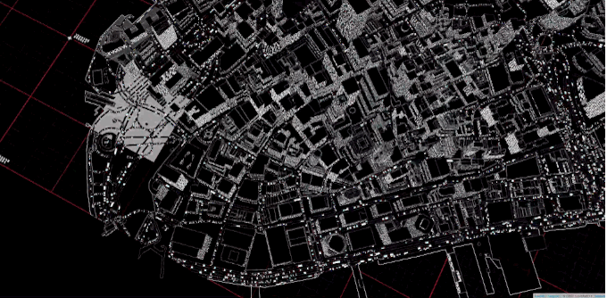

# RandomCity

**Description**: The incessant energy of the city is transformed into aleatoric movement covering the extruded and tessellated forms of crowdsourced OpenStreetMap data. Though the streams are chaotic, they coalesce into a kind of digital harmony. Inspired by the artist [Ryoji Ikea](http://www.ryojiikeda.com/).

***Descripción**: La energía incesante de la ciudad se transforma en movimiento aleatorio que cubre las geometrías generadas de OpenStreetMap. Aunque las corrientes son caóticas, se unen en una armonía digital. Inspirado por el artista [Ryoji Ikea](http://www.ryojiikeda.com*/).*

**Author**: Patricio Gonzalez Vivo (Buenos Aires, 1982) is a New York based artist and engineer. He explores interstitial spaces between organic and synthetic, analog and digital, individual and collective.

Patricio studied and practiced psychotherapy and expressive art therapy. He holds an MFA in Design & Technology from Parsons The New School, where he now teaches. Currently he works as a Graphic Engineer at Mapzen making openSource mapping tools.

## Displaying individual Shaders on RaspberryPi

- After installing Raspbian, set the GPU memory to 258

- Install [GlslViewer](https://github.com/patriciogonzalezvivo/glslViewer.git) 

```bash
cd ~ 
git clone http://github.com/patriciogonzalezvivo/glslViewer
cd glslViewer
make
sudo make install
```

- Clone this repository

```bash
cd ~ 
git clone https://github.com/patriciogonzalezvivo/RandomCity.git
```

- Open crontab

```bash
crontab -e
```

- Add ```runShader.sh``` to crontab list to be run every reboot.

```
@reboot /home/pi/RandomCity/shaders/./runShader.sh
```

### To Change the shader just do

```bash
cd ~/RandomCity/shaders
ln -sf 00.frag default.frag
```
